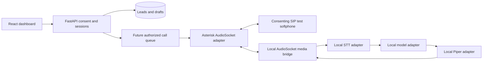

# Akki Telephony: private lab and staged integration plan

Own the application, AI pipeline, call state and CRM integration. Asterisk is a
reasonable initial PBX for a private SIP lab. An authorized PSTN connection is still
required for Indian mobile/landline calls. Open-source PBX software provides neither
free carrier connectivity nor promotional calling authorization.

Dashboard, consent controls, database, text sessions, local microphone STT/TTS and
prototype interruption handling exist. The [private Asterisk SIP lab](PRIVATE_SIP.md)
passed a two-way audio check. The [Linux AudioSocket bridge](SIP_AI_BRIDGE.md) now
connects the AI engine to private SIP calls. There is no ARI adapter, automatic call
queue or PSTN connection. See [local speech setup](LOCAL_SPEECH.md).

1. **Conversation lab:** evaluate extraction, opt-outs and latency on the intended laptop.
   Review drafts manually. Evaluate Hindi/Telugu separately with speakers.
2. **Local speech:** add interchangeable recognizer/synthesizer adapters. Compare
   faster-whisper and appropriately licensed TTS voices using consenting test speech.
   Measure recognition errors, pronunciation, latency, silence timeouts and cancellation.
   Add recording controls before saving audio.
3. **Private SIP-to-SIP:** configure two authenticated allowlisted Asterisk test extensions
   and consenting softphones. Test audio independently of AI. No trunk, external dialplan
   or arbitrary destinations. Protect SIP/RTP and admin interfaces on a private network.
4. **AI/SIP bridge:** select an ARI/media interface for the actual Asterisk version.
   Test codecs, sample rates, pacing, audio loss, interruption cancellation and hangup
   cleanup. Cancel pending model/TTS work on opt-out/hangup. This text API is a starting
   conversation contract, not a real-time media transport.
5. **Orchestration:** persist queued/dialing/ringing/connected/ended/failed/cancelled states,
   idempotency keys, provider events, contact limits, consent snapshots and audit history.
   Recheck consent on dispatch/retry; never retry declines or DNC. Allow approved test users only.
6. **PSTN after explicit approval:** verify licensed provider/SIP trunk eligibility and current
   India TRAI/DoT requirements. Review per-minute, number rental, setup, hosting and tax costs.
   Enforce hard quotas/spending controls. This milestone activates no paid account or trunk.

Laptop-off operation requires suitable always-on PBX, AI compute, database and backend.
Free sleeping HTTP hosts are insufficient for reliable SIP/RTP and low-latency inference.
Assess actual requirements and costs before hosting; zero-cost 24/7 service is not guaranteed.
