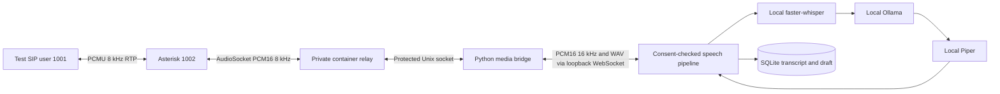

# Private SIP → AI media bridge

The local English voice engine now connects to Asterisk through AudioSocket. A
consenting synthetic SIP user 1001 can dial 1002, hear an AI introduction, speak
requirements, hear a contextual reply and opt out. Recognized text, reviewed-draft
requirements, call state and per-turn timings are saved in SQLite. No PSTN connection,
carrier account or automatic outbound dialing is configured.



## Linux setup

This implementation requires a **Linux backend and local Linux Docker Engine**,
Python 3.11+, Compose, and matching container/user UID 1000 permissions for the shared
socket. Native Windows is not supported by this Unix-socket bridge. WSL2 plus Docker
Desktop has not been validated; use a Linux filesystem rather than assuming sockets
work in a Windows `D:` bind mount. The browser microphone/text lab remains separate.

Complete [Ollama](LOCAL_AI.md) and [speech model setup](LOCAL_SPEECH.md), then from
the project root with the Python environment activated:

```bash
pip install -r backend/requirements-speech.txt
python -m scripts.setup_telephony
docker compose -f telephony/compose.yaml up --build -d
```

Stop any old backend. Start the local backend explicitly with the private lab enabled:

```bash
export AKKI_SIP_LAB=1
export OLLAMA_NUM_THREADS=2
python -m uvicorn backend.main:app --host 127.0.0.1 --port 8000 --ws-max-size 65536
```

Keep Ollama on `127.0.0.1:11434` with `OLLAMA_NO_CLOUD=1`, and run `npm run dev` from
`frontend`. The SIP bridge connects to the speech WebSocket at backend port 8000.
Run a **single** Uvicorn worker. Setting a `.env` value requires `--env-file .env`;
ordinary Python does not automatically load it. Explicit exported variables take
precedence over that file. The lab is disabled by default (`AKKI_SIP_LAB=0`).

The setup script preserves existing test passwords and adds a random relay credential.
It creates gitignored `telephony/runtime/ipc`; the relay writes `audio.sock` there with
mode 0600. Do not share credentials or grant public access to the directory. The
container remains on an internal network and opens no HTTP/ARI/AMI administrative API.
In the tested Docker 28 environment, internal networking did not publish host SIP ports;
tests therefore use a SIP caller inside the container. Same-host softphone port mapping
and Windows networking are unverified. Do not weaken isolation to work around this.

## Run the complete synthetic call

In another activated project-root terminal:

```bash
python -m scripts.check_sip_ai --run-private-test
python -m scripts.check_sip_ai --run-private-test --barge-in
python -m scripts.check_sip_ai --run-private-test --hangup-during-inference
```

Run these sequentially. Each explicitly creates a fictional consented lead and session,
synthesizes English fixtures locally, reserves one call, runs a private SIP caller and
checks the saved outcome. The first two check menu/budget extraction and DNC after
spoken opt-out. The third observes model inference, hangs up and verifies revision 0.
The helper cleans up its fixture PCM files and active reservation. Fictional CRM test
records remain locally; use the dashboard to delete transcripts/drafts afterward.
The normal test saves no received audio; `ai_sip_smoke.py --capture-test-wavs` is a
separate explicit synthetic-test-only capture option in container `/tmp`.

## Dashboard operation

Open **AI conversation lab**, select a consenting test lead, accept collection
permission and start a session. Under **Private SIP conversation**, confirm audio
processing permission and click **Reserve private SIP session**. Models load before
the relay is reserved. Status `waiting · dial-1002` means the consenting private SIP
user can dial 1002. Typed replies and browser microphone capture are blocked while
SIP owns the session. **Disconnect SIP call** closes media, invalidates pending model
work and releases the reservation. Leaving the panel also disconnects its reservation.
Use the scripted test caller until human softphone connectivity has been verified.

When no AI session is reserved, 1002 still routes to the original SIP endpoint. The
original `sip_smoke.py` two-user test continues to work. Never run it concurrently
with an AI reservation.

## Controls, timing and limits

- Relay authentication, exact session UUID and one-call admission protect the bridge.
  Active lead/contact and collection consent plus separate audio permission are needed.
  Only English and fixed private extension 1002 are accepted; there is no arbitrary
  phone number field. This is a loopback development API, not production authentication.
- The relay validates the AudioSocket identity before forwarding audio. The backend
  bounds payload sizes, converts 8 kHz PCM to 16 kHz for recognition, resamples Piper
  WAV to 8 kHz, and paces reply frames every 20 ms. Linear interpolation is a prototype
  resampler; narrowband audio does not preserve high-frequency speech information.
- Speech onset stops queued playback and pending generation. Audio already transmitted
  cannot be recalled; noise/echo detection and human barge-in quality need evaluation.
  Already committed turns remain saved. Opt-out persists before closing speech.
- Explicit AudioSocket hangup messages close the call. EOF/disconnect closes the speech
  WebSocket, whose generation/revision guard discards canceled inference. Transport/model
  failures end the call without automatic retry. No automatic redial is implemented. Startup marks interrupted call records cancelled
  and never resumes a call.
- Call waiting is capped at 120 seconds; a running media connection at five minutes.
  AudioSocket reads have a 30-second inactivity limit. Only one call may run at a time.
- Warm-up uses the same model thread/context options as actual inference to prevent
  reloading at the first turn. Prompts ask for short replies and new-field updates;
  required extraction keys preserve budget/timeline/callback/features. Human review
  remains mandatory. STT/TTS execute after utterance endpointing; progressive speech
  recognition and synthesis are not implemented.
- Successful final synthetic qualification: STT 673 ms, model 4656 ms, TTS 1377 ms,
  **6708 ms after endpointing**, plus speech and 600 ms silence. Before matching warm-up
  options the bridged turn took 11200 ms. These observations are not controlled
  benchmarks, reliability guarantees or sufficient latency for natural live calling.

API: `GET /api/telephony/status`,
`POST /api/telephony/sessions/{id}/connect` with
`{"audio_processing_consent":true}`, `GET /api/telephony/calls/{call_id}` and
`POST /api/telephony/calls/{call_id}/stop`. State, latest transcript and per-turn timings
are available; no raw audio or relay credential is stored in CRM history. Deleting
a session cascades to its call history. Protect SQLite and backups as private data.

Stop the lab with `docker compose -f telephony/compose.yaml down` and stop the backend.
Nothing here activates a paid service. Indian mobile/landline calls still require an
authorized provider, applicable telecom/consent arrangements and explicit spending
approval. Human speech, Hindi/Telugu, Windows, production security and commercial
calling remain outside the verified scope.
